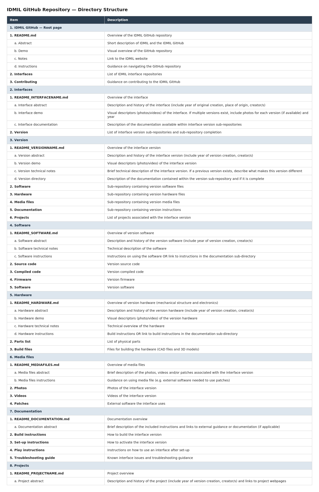

# IDMIL-Interface-Repository
This repository contains every control system/interface developed at IDMIL, 
organized by interface name and interface version number

**Note**: A complete list of the interfaces documented within this repository can be found here: [Interface List](INTERFACES/README_INTERFACES.md)

**About this repository**
1)	This repository is oriented around individual interfaces
> a)	An interface is any control system which a user interacts with directly

> b)	An interface has software components and (usually) hardware components 
> > i)	Example: The T-Stick is an interface. It has both software and hardware components
> > 
> > ii)	Example: LibMapper is an interface which only has software components
2)	This repository is modular
> a)	Every record of an interface includes the software, hardware, media files, documentation and project modules associated with the interface version
3)	Any change to the hardware and/or software of an interface constitutes a new version of the interface
> a)	Every interface version has its own record within the repository 
> > i)	Example: A hardware change to the Agbau, even when it functions the same, constitutes a new version of the interface
4)	Every record of an interface includes the software, hardware, media files, documentation and project modules associated with the interface version
> a)	A record documents any changes between interface versions
> > 
> b)	Modules can be duplicated or linked across multiple interface versions if a change has only occurred within one component of the interface
> > i)	Example: A software update to the T-Stick constitutes a new version of the interface. A new software documentation module should be created reflecting the update. If the hardware has not changed

